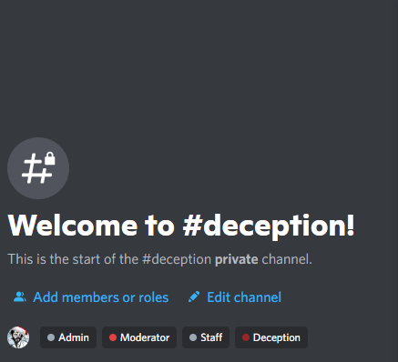

# interaction-prototypes
> Generated from `slash-create-template` using [`slash-up`](https://github.com/Snazzah/slash-up).
A collection of interaction prototypes made purely for testing, with the intention of using them for services in the future.

## [Game lobby handler](./src/util/game.ts) ([Video](./assets/lobby-interaction-demo.mp4))

- Lobby names use the NATO phonetic alphabet.
- `#initialRoster` will clone itself before being used for rendering the list of players. Since it uses 3 inline fields to render the list, it will determine where each player goes - for mobile compatibility, it will render the numbers vertically.
  > Originally it was intended to use `index % 3` but it now uses `index / 3` to ensure numbers are grouped together.
- It will not allow players to join the lobby if it is full, and it will not allow the host to leave the lobby.
- Components will enable themselves once their condition has been met.

## License

This project is licensed under the GNU General Public License v3.0. See the [LICENSE](LICENSE) file for more information.
